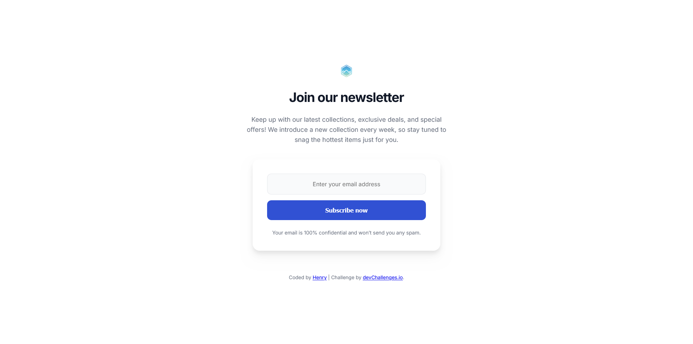

<!-- Please update value in the {}  -->

<h1 align="center">Join Our Newsletter | devChallenges</h1>

   Solution for a challenge <a href="https://devchallenges.io/challenge/join-our-newsletter" target="_blank">Join Our Newsletter</a> from <a href="http://devchallenges.io" target="_blank">devChallenges.io</a>.

  <h3>
    <a href="https://henrydevlab.github.io/join-our-newsletter/">
      Demo
    </a>
     | 
    <a href="https://github.com/Henrydevlab/join-our-newsletter">
      Solution
    </a>
     | 
    <a href="https://devchallenges.io/challenge/join-our-newsletter">
      Challenge
    </a>
  </h3>

<!-- TABLE OF CONTENTS -->

## Table of Contents

- [Overview](#overview)
  - [What I learned](#what-i-learned)
  - [Useful resources](#useful-resources)
- [Built with](#built-with)
- [Features](#features)
- [Contact](#contact)
- [Acknowledgements](#acknowledgements)

<!-- OVERVIEW -->

## Overview

This project is a responsive newsletter subscription component built to match a specific design provided by devChallenges.io. It focuses on precise typography, specific line breaks for mobile devices, and accessible form elements.

### What I learned

While building this project, I improved my skills in:
- **Precise Typography Control:** Using `max-width` with `ch` units to force specific line breaks in the description and privacy notice to match the design images exactly.
- **Responsive Alignment:** Implementing different text alignments for mobile versus desktop layouts—specifically left-aligning the privacy notice on mobile.
- **Accessibility:** Using `aria-label`, `aria-required`, and `.sr-only` classes to ensure the form is usable for screen readers.
- **SEO Optimization:** Implementing essential Meta and Open Graph tags for better search engine and social media visibility.

### Useful resources

- [MDN Web Docs - Responsive Design](https://developer.mozilla.org/en-US/docs/Learn/CSS/CSS_layout/Responsive_Design) - This helped me understand fluid grids and media queries.
- [A11y Project](https://www.a11yproject.com/) - A great resource for implementing the accessibility best practices used in this form.

### Built with

- Semantic HTML5 markup
- CSS custom properties
- Flexbox

## Features

- Fully responsive layout for Mobile, Tablet, and Desktop.
- Exact typography and line-break matching based on provided JPG designs.
- Accessibility-first form design.
- SEO and Open Graph metadata.

This application/site was created as a submission to a [DevChallenges](https://devchallenges.io/challenges-dashboard) challenge.

## Acknowledgements

- Thanks to [devChallenges.io](https://devchallenges.io/) for providing the design assets and challenge requirements.

## Author

- GitHub [@henrydevlab](https://github.com/henrydevlab)
